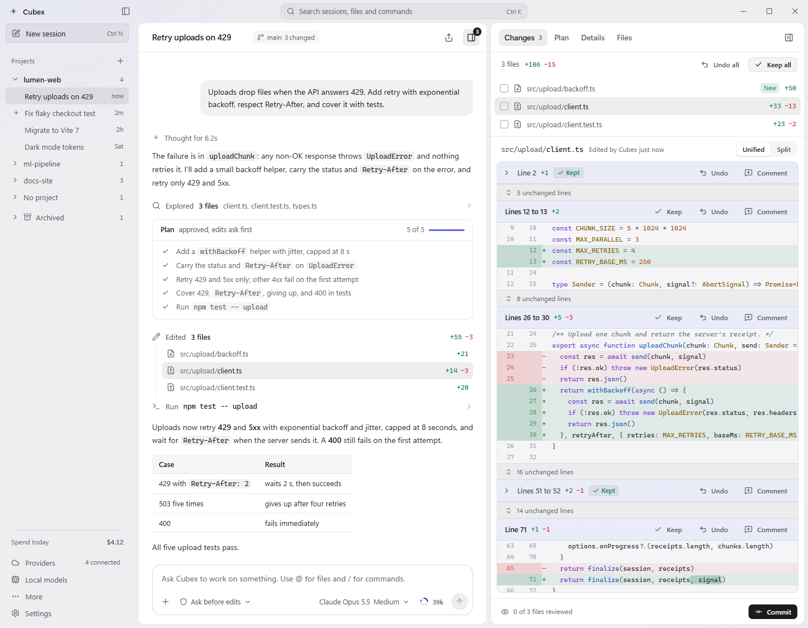
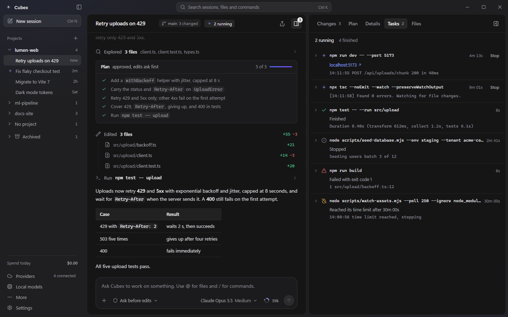
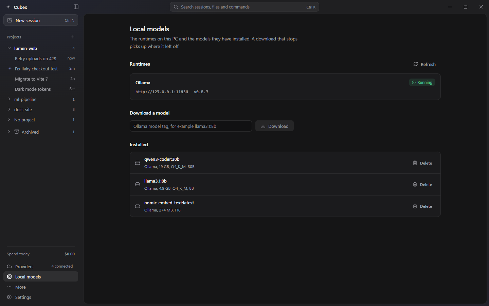
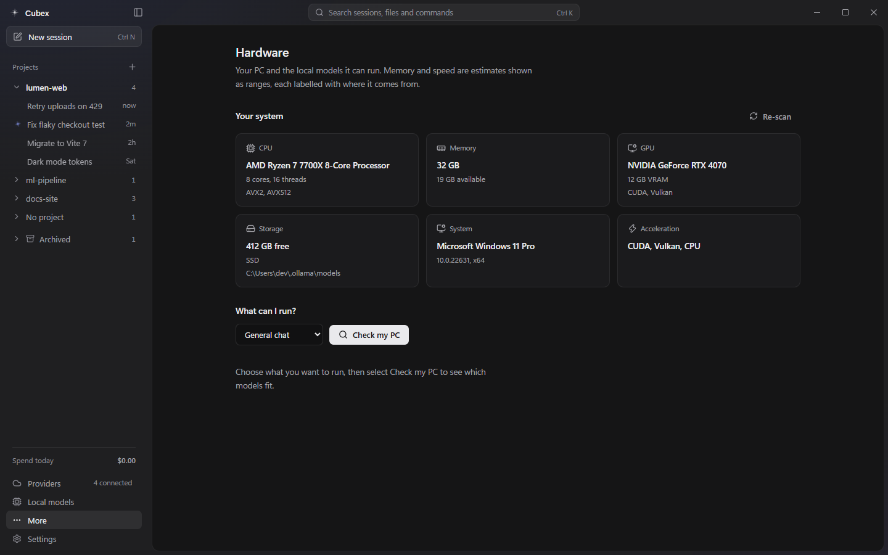

<div align="center">


# Cubex

**A desktop coding agent for any model.**

Connect a cloud provider or a model running on your own machine, point Cubex at a project,
and review every change it makes before it lands.

[Download](https://github.com/HeshamXOR/Cubex/releases/latest) &nbsp;|&nbsp;
[Features](#features) &nbsp;|&nbsp;
[Build from source](#build-from-source) &nbsp;|&nbsp;
[Documentation](#documentation)

[](https://github.com/HeshamXOR/Cubex/releases/latest)
[](https://github.com/HeshamXOR/Cubex/actions/workflows/ci.yml)
[](LICENSE)


</div>

<p align="center">
  <picture>
    <source media="(prefers-color-scheme: dark)" srcset="docs/images/cubex-dark.png">
    
  </picture>
</p>

Cubex is a desktop app for working with a coding agent on your own code. You choose the model, either
from a cloud provider with your own API key or from a runtime on your machine such as Ollama. Cubex reads
your project, edits files, runs commands and searches the web when you let it, and shows each change as a
diff that you can keep, undo or comment on, one hunk at a time, before anything is committed.

There is no account, no Cubex server and no telemetry. API keys live in your operating system's credential
store, and conversations stay in a local database.

## Why Cubex

- **One workflow for every model.** Claude, GPT, Gemini, hosted open models and local models get the same
  chat, tools, review and cost tracking. Switching models is a menu choice, not a different app.
- **You decide what the agent may do.** Four permission modes, rules you save per project, hooks, and a plan
  you approve before any file is touched.
- **Changes are reviewed, not trusted.** Every edit arrives as a diff. Keep or undo it by file or by hunk,
  comment on a line and send the comments back, or restore the project to an earlier turn.
- **Context and spending are visible.** See what fills the context window, summarize it without losing the
  history, and set spending caps per turn, per session and per day.
- **Local models are first-class.** Cubex checks what your hardware can run, works with Ollama, LM Studio and
  llama.cpp, and has a mode that never sends a request to a cloud provider.

## Install

Cubex is built and tested on Windows 10 and 11 (x64).

1. Download `Cubex-Setup-0.1.0.exe` from the [latest release](https://github.com/HeshamXOR/Cubex/releases/latest).
2. Run it. The installer lets you choose the folder, and adds Start menu and desktop shortcuts.
3. If Windows SmartScreen shows "Windows protected your PC", select **More info**, then **Run anyway**. The
   installer is not code-signed yet, so Windows does not recognize the publisher. Compare the file with the
   SHA-256 checksum in the release notes if you want to be sure it is the one published here.

macOS and Linux targets are configured in the repository but have not been tested. To try them, see
[Build from source](#build-from-source).

## Quick start

1. Open **Providers**, choose **Add provider**, pick a preset and paste your API key. Select **Test connection**
   to confirm it works.
   - Cubex talks to provider APIs with your own key. A ChatGPT or Claude chat subscription does not include API
     access, so it cannot be used here.
   - No key yet? Add **Offline demo**. It gives simulated replies, so you can try the whole flow without a model.
   - Want everything on your PC? Install [Ollama](https://ollama.com), then open **Local models** and download a
     model that fits your hardware.
2. Open your project folder from the Projects header in the sidebar, start a **New session** (`Ctrl+N`), pick a
   model and an effort level in the composer, and describe the task.
3. Follow the work in the conversation. Allow or deny what Cubex asks about, then review the result in the
   **Changes** tab.
4. Commit from the panel. Cubex drafts the message and never pushes.

## Features

### Models and providers

Cubex ships 17 provider presets:

| Where it runs | Providers |
|---|---|
| Cloud | OpenAI, Anthropic, Google Gemini, Azure OpenAI, OpenRouter, Groq, Together, DeepSeek, Mistral, xAI, NVIDIA |
| On this PC | Ollama, LM Studio, llama.cpp |
| Anything else | Custom endpoint (any OpenAI-compatible server), Custom JSON API (you map the request and response fields), Offline demo |

- **Native adapters where it matters.** Anthropic, OpenAI (Responses and Chat Completions), Gemini and Ollama
  each have their own adapter. The other hosted services, LM Studio and llama.cpp share an OpenAI-compatible one.
- **Effort that matches the model.** The effort slider shows the steps the selected model supports, and
  nothing when it has none. The most expensive step is marked as such.
- **Long context when the model offers it.** Name the models that have a 1M-token window in the provider form;
  a **1M context** switch then appears for them in chat, and turning it on lets the context meter use the full window.
- **Test connection.** Reports how fast the provider answered and how many models it lists. When it fails,
  Cubex says what happened and what to change.
- **Requests that recover.** Transient failures such as rate limits, overloaded servers and dropped
  connections retry with exponential backoff and jitter, and honor `Retry-After`. Authentication and
  invalid-request errors never retry. A stream is retried only before its first token, so an answer you have
  started reading is never silently restarted.

### Working with the agent

- **Plan first.** In Plan mode Cubex researches with read-only tools and writes a Markdown plan. You approve it,
  choosing the permission mode for the implementation, or reject it with feedback. Revisions are saved.
- **Four permission modes.** Ask before edits (the default), Accept edits, Plan mode and Bypass permissions.
  `Shift+Tab` cycles them. An approval card offers Allow once, Always allow for this project, or Deny, and each
  has a key (`Enter`, `Esc`). Saved rules are listed in Settings as plain sentences.
- **A real tool set.** Read files in pages, search by regex, glob and list. Write, edit, multi-edit, apply a
  patch and remove files. Run commands in the shell you choose. Git status, diff, log, show, blame, branch and
  commit. Web search and page fetch, a to-do list, questions back to you, and any MCP tools you add.
- **Safe file edits.** An edit is rejected when the file changed since Cubex last read it. Paths outside the
  project folder, including through symlinks, are refused.
- **Research subagents.** Cubex can hand a bounded, read-only subtask to a subagent and show what it did.
- **Queue messages.** Keep typing while Cubex works. Messages wait in a queue and send when the turn ends.
  `Esc` stops the running turn.
- **Go back.** Restore code and conversation, only the conversation, or only the code, to any earlier message.
  Files you edited yourself are left alone, and a restore can be undone.
- **Type checking after edits.** After Cubex edits a TypeScript or JavaScript file, the model is told about any
  new compiler errors so it can fix them. This uses the TypeScript installed in your project.
- **Slash commands.** `/goal`, `/new`, `/system`, `/workspace`, `/model`, `/compact`, `/retry`, `/title`,
  `/export`, `/clear`, `/cost`, `/hardware` and `/settings`. Type `@` to add a file. Typing `/` also lists every
  skill the model could use, with where it comes from, so you can run one yourself: `/debugging the save button
  does nothing` applies that skill to the message and sends it.

### Review every change

The **Changes** tab lists each file Cubex touched, with the numbers of lines added and removed.

- Keep or undo each hunk. Undo a whole file, or use Keep all and Undo all. Undo puts a file back to how it was
  before the session.
- Switch between unified and split diffs. Unchanged lines collapse and expand.
- Comment on a line or a range. Comments queue in a tray and go back to Cubex as one message.
- Commit from the panel: choose the files, adjust the message Cubex drafted, and commit. Cubex never pushes.

### Work that keeps running

Dev servers, watchers and long builds keep running while the conversation moves on. The **Tasks** tab lists
each one with its latest output and elapsed time, and a **Stop** button. Finished, failed and timed-out tasks
stay inspectable. Cubex can read a task's output and send it input.

<p align="center">
  
</p>

### Context and cost

- **Context inspector.** The ring beside the composer shows how full the context window is. Open it for a
  breakdown: system instructions, conversation, tool results, built-in tools, MCP servers, attachments and the
  space reserved for the answer, next to what the provider reported for the last request.
- **Summarizing without loss.** When a conversation nears the limit, Cubex replaces older messages in new
  requests with a short summary, either automatically at a threshold you set or when you run `/compact`. The
  full history stays saved. Output from earlier tool calls is trimmed first, and the model can run a tool
  again if it needs the output back.
- **Spending caps.** Set a limit per turn, per session and per day, and choose what happens at the limit:
  stop, or warn. Cubex counts the cost that a provider reports with each answer (OpenRouter does). Usage from
  a model with no price shows as "No price" and is not counted toward the caps. Local models cost nothing.

### Local models

Open **Hardware** to see what your PC has (CPU, memory, GPU and VRAM, storage) and which models from a curated
catalog of 19 it can run for what you want to do: general chat, coding, reasoning, fast responses, long
context, vision, low memory or maximum quality. Each model gets a verdict (fits in VRAM, needs CPU and RAM
offload, may be slow, not enough memory), a memory range and a speed range. Every estimate is shown as a
range and labeled with what it is based on, never as a promise.

**Local models** detects a running Ollama, lists what is installed and downloads new models with progress you
can cancel. **Local-only mode** in Settings sends requests to local providers only. It does not block tools or
downloads.

<table>
  <tr>
    <td width="50%"></td>
    <td width="50%"></td>
  </tr>
</table>

### Extending Cubex

- **MCP servers.** Add stdio servers from Settings, with arguments as a validated JSON list so paths with
  spaces survive. Environment variables can be marked secret and are kept in the OS credential store. Their
  tools appear next to the built-in ones and go through the same permission checks.
- **Hooks.** Run your own commands on `PreToolUse`, `PostToolUse`, `UserPromptSubmit` and `Stop`. A
  `PreToolUse` hook can stop a tool call. Match tools by name, and test a hook from Settings before relying on it.
- **Skills.** 18 skills ship with Cubex (software engineering workflow, debugging, testing, code review,
  security review, TypeScript and Python, frontend and backend, system design, research, technical writing and
  more). Cubex sees only their short descriptions until a task needs one, then loads the full instructions.
  Put your own in `.cubex/skills`, `.agents/skills` or `.claude/skills` in a project, and they override the
  bundled ones by name.
- **Project instructions.** `AGENTS.md`, `CLAUDE.md` and `.cubex/AGENTS.md` in the project root are added to the
  system prompt.
- **Your shell.** Choose which shell runs commands: Git Bash, PowerShell 7, Windows PowerShell or Command
  Prompt on Windows, and the system shell on macOS and Linux. Cubex tells the model which syntax to use.

### Everyday details

- A command palette (`Ctrl+K`) searches sessions, files and commands. `Ctrl+/` lists every keyboard shortcut.
- Sessions are grouped by project, renamed in place and archived when you are done. Export one as Markdown,
  JSON or text.
- Notifications tell you when a session needs you, finishes or fails, and stay quiet while Cubex is in front.
  The taskbar button flashes and shows a badge until you are back.
- Text and source files can be attached to a message. Unsupported formats say so instead of failing quietly.
- Light and dark themes, with reduced motion respected.

## Privacy and security

- **Keys.** API keys are encrypted with the OS credential store (DPAPI on Windows, Keychain on macOS, libsecret
  on Linux) through Electron `safeStorage`. They are never written to the config file or the database. If the
  OS cannot encrypt, Cubex refuses to save a key and reads it from an environment variable instead.
- **No telemetry.** Cubex sends nothing about you or your usage anywhere.
- **Where requests go.** Only to the providers you configure, and wherever the tools you allow reach: web
  search through DuckDuckGo, page fetches, MCP servers you add and Ollama downloads.
- **Local data.** Conversations, plans and command output are kept in a local SQLite database and files in
  `cubex-data`, inside Cubex's application data folder. They are not encrypted by Cubex, and command output can
  contain anything a command printed. Set `CUBEX_DATA_DIR` to keep the data somewhere else.
- **The renderer is sandboxed.** The UI has no Node access, runs with a content security policy, and talks to
  the main process only through a typed bridge.
- **Commands are not sandboxed.** Cubex asks before it runs one by default, but an approved command runs with
  your account's permissions. Read what you approve, and use the permission modes and hooks to set limits.

The details are in [docs/SECURITY.md](docs/SECURITY.md).

## Build from source

You need Node.js 20 or 22 (CI uses 22), npm and Git. On those versions the native SQLite module installs as a
prebuilt binary. On Node.js 24 and newer none exists yet, so npm compiles it, which needs Python 3 and the Visual
Studio Build Tools with the C++ workload.

```bash
git clone https://github.com/HeshamXOR/Cubex.git
cd Cubex
npm install
npm run dev
```

| Command | What it does |
|---|---|
| `npm run dev` | Starts Cubex in development with hot reload |
| `npm run dev:web` | Serves only the interface in a browser with demo data, for UI work without Electron |
| `npm test` | Runs the Vitest suite, about 4,500 tests, with no credentials or GPU needed |
| `npm run typecheck` | Strict TypeScript check of the main process and the interface |
| `npm run lint` | Runs ESLint |
| `npm run build` | Compiles main, preload and renderer into `out/` |
| `npm run dist:win` | Builds the Windows installer into `release/` |

`npm run dist:linux` and `npm run dist:mac` are configured too, and must be run on their own operating system.
They are untested.

## How it is built

```
Renderer (React)  <--IPC-->  Main (Electron, Node)  -->  AI gateway  -->  Provider or runtime adapter
```

| Layer | Location | What it does |
|---|---|---|
| Core | `packages/core` | Provider-agnostic TypeScript: unified types, the gateway, retry, streaming, error normalization, redaction, provider adapters and the tool runner. No Electron or DOM imports, so the whole cloud pipeline is tested with mock providers |
| Local | `packages/local` | Hardware profiling, memory and speed estimation, compatibility scoring, local runtimes and the model catalog |
| Main | `src/main` | The Electron main process: chat service, tools, IPC, credentials, SQLite, MCP client, shell and task manager, diagnostics, notifications |
| Preload | `src/preload` | The typed `window.cubex` bridge, with context isolation on |
| Renderer | `src/renderer` | The React interface |
| Shared | `src/shared` | The IPC contract and settings types |
| Skills | `agent-skills-library` | The 18 bundled skills |

The stack is Electron 33, React 18, strict TypeScript, Vite through electron-vite, Zustand, SQLite through
better-sqlite3 and Vitest. [docs/ARCHITECTURE.md](docs/ARCHITECTURE.md) walks through the layers.

## Status

Cubex is at version 0.1.0. About 4,500 automated tests cover it, but it is young. What to know before you
rely on it:

- Windows x64 is the only platform that has been built and tested. The installer is unsigned.
- Sessions work directly in your project folder. There are no isolated worktrees yet, so do not run two
  sessions that change the same files at the same time.
- File restore points live in memory. After Cubex restarts you can still restore the conversation, but not the
  files.
- Costs are counted only when the provider reports them, as OpenRouter does. Cubex has no built-in price list
  yet, so for other cloud models the usage shows as "No price" and the spending caps do not cover it.
- MCP supports stdio servers. HTTP and SSE servers are not supported yet, and secret values are scrubbed from
  output by exact match only.
- Local benchmarks have an engine in `packages/local` but no interface in this release.
- Desktop notifications, taskbar flashing and the badge are covered by unit tests, but have not been checked by
  hand in a packaged build.

Found something wrong? Please [open an issue](https://github.com/HeshamXOR/Cubex/issues) with what you did and
what you saw.

### Next

Ideas that are being considered, with no dates attached:

- A second opinion: ask another model to critique a plan or a diff, for a bounded number of rounds, and report
  where the two disagree instead of forcing them to agree.
- Git worktrees per session, so sessions can run side by side on one project.
- Restore points that survive a restart.
- Built-in prices for cloud models, so the spending caps work with every provider.
- MCP over HTTP and SSE.
- A benchmark page for local models, and signed installers for more platforms.

## Documentation

| Guide | What is in it |
|---|---|
| [Architecture](docs/ARCHITECTURE.md) | Layers, data flow and extension points |
| [Providers](docs/PROVIDERS.md) | Adding a provider or an OpenAI-compatible endpoint |
| [Harness workflow](docs/HARNESS_WORKFLOW.md) | Plans, permissions, review and workspace tools |
| [Skills](docs/SKILLS.md) | The bundled skills, on-demand loading and project overrides |
| [Local models](docs/LOCAL_MODELS.md) | Runtimes, downloads and the model catalog |
| [Hardware analyzer](docs/HARDWARE_ANALYZER.md) | How hardware is detected and estimates are made |
| [Benchmarks](docs/BENCHMARKS.md) | How the benchmark engine measures |
| [Security](docs/SECURITY.md) | Credentials, sandboxing and the permission model |
| [Development](docs/DEVELOPMENT.md) | Setup, scripts and project layout |
| [Testing](docs/TESTING.md) | The test suite and how to extend it |

## Contributing

Issues and pull requests are welcome. Read [CONTRIBUTING.md](CONTRIBUTING.md) first. In short: keep
`packages/core` free of Electron and DOM imports, add tests with your change, and run `npm run typecheck`,
`npm run lint` and `npm test` before you open a pull request.

## License

[MIT](LICENSE). Open-source model licenses are shown in the app as their authors declare them, so check a
model's license before you use it commercially.

Icons are from [Lucide](https://lucide.dev).
