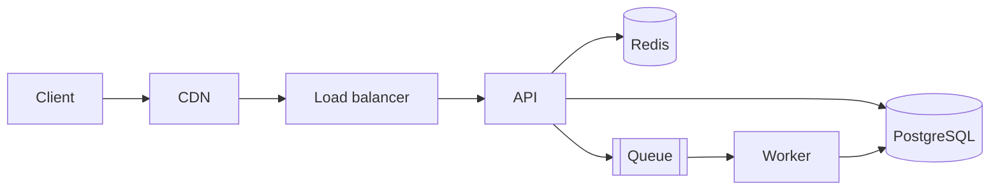

# System Design

Good design is the result of explicit requirements, honest trade-offs, and the simplest structure that meets them. Prefer boring, proven technology; add complexity only when a measured need justifies it.

## 1. Process

1. **Clarify the problem and users.** Who uses it, for what, and what does success look like? What is out of scope?
2. **Requirements**
   - *Functional*: the core use cases and APIs (write the top 3 to 5 user stories).
   - *Non-functional*: scale (users, requests per second, data volume, growth), latency targets (p50/p95/p99), availability (SLO), durability, consistency needs, security and compliance, cost limits, operability, team size and skills, time to market.
   Turn vague words into numbers ("fast" becomes p95 under 300 ms; "reliable" becomes 99.9% monthly).
3. **Estimate capacity** with back-of-the-envelope math: requests per second (average and peak, peak is often 2 to 10 times average), storage per day/year, bandwidth, memory for caches, number of servers. State assumptions. Order-of-magnitude accuracy is enough.
4. **Start simple** with a single deployable unit (modular monolith), one relational database, a cache only if needed. Sketch the high-level architecture and data flow.
5. **Define the data model and APIs.** Data is harder to change than code: entities, relationships, ownership, consistency boundaries, retention, and access patterns first.
6. **Deep-dive on the hard parts**: the bottleneck, the consistency-critical flow, the fan-out, the hot key, the expensive query, the security boundary.
7. **Analyze failure modes and trade-offs.** For each component: what if it is slow, down, or wrong? What is the blast radius and recovery? Which trade-off did we choose (consistency vs availability, latency vs cost, simplicity vs flexibility)?
8. **Plan evolution and rollout**: migration path, phasing, feature flags, observability, capacity review triggers ("revisit when writes exceed 5k/s").
9. **Document** the design (template in `assets/design-doc-template.md`) and decisions (`assets/adr-template.md`), with diagrams.

## 2. Architecture style selection

| Style | Choose when | Watch out for |
|---|---|---|
| Modular monolith | Most products, small to mid teams, early stage, unclear boundaries | Discipline needed to keep modules decoupled (enforce with lint/architecture tests) |
| Microservices | Independent scaling or deployment needed, many teams, clear bounded contexts, strong platform maturity | Distributed systems tax: network failures, consistency, observability, deployment complexity, cost |
| Serverless / functions | Spiky or low traffic, event-driven glue, minimal ops | Cold starts, vendor lock-in, execution limits, local testing difficulty |
| Event-driven / streaming | Decoupled producers and consumers, audit trail, fan-out, real-time processing | Eventual consistency, ordering, schema evolution, debugging |
| Batch / ETL | Large periodic processing, analytics | Latency, reprocessing, idempotency |
| CQRS / event sourcing | Very different read and write models, need full history | Significant complexity; use only for a proven need |

Default: **modular monolith first**, extract services when a boundary is stable and a real constraint (scale, team autonomy, blast radius, technology) demands it.

## 3. Building blocks and when to use them

- **Load balancer / API gateway**: TLS termination, routing, auth, rate limiting.
- **Caching**: client, CDN, application (Redis), database buffer. Decide what is cached, TTL, invalidation strategy (TTL, write-through, cache-aside, event-based), stampede protection (locks, request coalescing, jittered TTL). Caches are for performance, not correctness.
- **Database**: relational by default; add read replicas for read scale (mind lag); partition/shard only when a single node cannot cope (choose shard key to avoid hot spots; cross-shard queries and transactions are costly). See `backend-engineering`.
- **Queues and streams**: decouple, absorb spikes, retry. Queue (SQS, RabbitMQ) for tasks; log/stream (Kafka, Kinesis, Redpanda) for replayable event streams.
- **Object storage and CDN**: large files and static assets.
- **Search**: dedicated engine when relevance ranking, facets, or scale exceed database full-text.
- **Async workers and schedulers**: background jobs with idempotency and retries.
- **Service discovery, config, secrets**: managed platforms where possible.
- **Observability**: logs, metrics, traces, SLOs from day one.

## 4. Key concepts to apply

- **CAP and PACELC**: during a network partition choose consistency or availability; otherwise trade latency for consistency. Most business systems need strong consistency for money/inventory and tolerate eventual consistency for feeds, counters, and search.
- **Consistency models**: strong, read-your-writes, monotonic reads, eventual. Pick per operation.
- **Idempotency and exactly-once effects**: at-least-once delivery plus idempotent handlers; idempotency keys; deduplication.
- **Distributed transactions**: avoid two-phase commit; use sagas (compensating actions), outbox pattern, or redesign to keep a consistency boundary within one database.
- **Scaling**: scale up first (simple), then out. Stateless services scale horizontally; state goes to dedicated stores. Identify the single bottleneck and remove it; then find the next.
- **Hot keys and thundering herds**: shard hot keys, cache, rate limit, jitter.
- **Backpressure and load shedding**: bounded queues, timeouts, 429/503 under overload.
- **Multi-region**: adds cost and complexity; start with multi-AZ; go multi-region for latency or disaster-recovery RTO/RPO targets that require it. Define active-passive vs active-active and data replication implications.
- **Security by design**: trust boundaries, least privilege, secrets management, encryption, audit logging, tenant isolation. See `security-review`.
- **Cost**: model cost per user/request; watch egress, storage growth, chatty services, over-provisioning; add budgets and alerts.
- **Operability**: deployability, rollbacks, runbooks, on-call load. A design that the team cannot run is a bad design.

## 5. Estimation cheat sheet

- 1 day = 86,400 s (about 10^5). 1 million requests/day is about 12 requests/s average.
- Peak factor 3 to 10 times average; design for peak plus headroom (30 to 50 percent).
- Storage: rows x average size x replication x growth; 1 KB x 1 billion = 1 TB.
- Latency (rough, same region): memory ~100 ns; SSD random read ~100 us; same-AZ network round trip ~0.5 ms; cross-region ~50 to 150 ms; disk seek (HDD) ~10 ms.
- A modern single relational database node can typically serve on the order of thousands to tens of thousands of simple queries per second; measure your own workload.
- Availability: 99.9% = 43.8 min downtime/month; 99.99% = 4.4 min/month. Serial dependencies multiply availability (0.999 x 0.999 = 0.998).

## 6. Diagrams

Use Mermaid in Markdown so diagrams live in version control:

Provide at least: context diagram (system and external actors), container/component diagram (deployable pieces), key sequence diagrams for critical flows, and a data model (ERD). Label protocols, data ownership, and trust boundaries.

## 7. Trade-off analysis format

For each significant decision:
```
Decision: <what>
Options: A (...), B (...), C (...)
Criteria: latency, consistency, cost, complexity, team skills, operability, lock-in
Choice: B, because <reasoning against criteria>
Consequences: <good and bad>, <what would make us revisit>
```
Record long-lived decisions as ADRs (see `assets/adr-template.md`). Number them, never edit accepted ones (supersede instead), and store them beside the code.

## 8. Design review checklist

- [ ] Requirements are explicit, measurable, and agreed; non-goals stated
- [ ] Data model and ownership clear; consistency boundaries identified
- [ ] Every component has a failure story; no unexplained single point of failure
- [ ] Capacity math shows headroom; growth triggers defined
- [ ] Security, privacy, and compliance addressed (authn/z, encryption, retention)
- [ ] Observability and SLOs defined; deployment and rollback planned
- [ ] Migration/rollout path from the current state exists and is incremental
- [ ] Cost estimated; simpler alternatives considered and documented
- [ ] Open questions and risks listed with owners

## Asset files

- `assets/design-doc-template.md`: design document skeleton
- `assets/adr-template.md`: architecture decision record template
