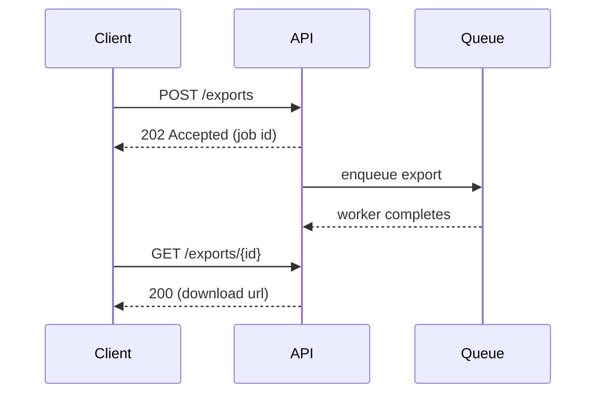

# Technical Writing

Good documentation lets the reader complete a task or build a correct mental model with minimal effort. Write for a specific reader, with a specific goal, at a specific moment.

## 1. Before writing

1. **Reader**: who are they (new hire, API consumer, operator on call at 3 a.m., executive)? What do they already know? What tools and access do they have?
2. **Goal**: what should they be able to do or decide after reading?
3. **Type of document** (Diataxis). Mixing types confuses readers:

| Type | Reader need | Form | Example |
|---|---|---|---|
| Tutorial | Learn by doing (study) | Guided lesson with a working outcome, minimal explanation, safe steps | "Build your first webhook handler" |
| How-to guide | Accomplish a specific task (work) | Steps for a real-world goal, assumes basics | "Rotate database credentials" |
| Reference | Look up facts (work) | Accurate, complete, structured, neutral; mirrors the code | API endpoints, config keys, CLI flags |
| Explanation | Understand why (study) | Discussion of concepts, design decisions, trade-offs | "How our retry and idempotency model works" |

4. **Source of truth**: derive reference docs from code where possible (OpenAPI, docstrings, `--help` output, generated config tables) so they cannot drift.

## 2. Writing principles

- **Lead with the point.** Put the answer, outcome, or summary first; details after. Every section starts with what it is for.
- **Plain language.** Short sentences (15 to 25 words), common words, active voice, present tense, second person ("you") for instructions. Define jargon on first use or link to a glossary.
- **One idea per paragraph; one action per step.** Number sequential steps; use bullets for parallel items.
- **Be concrete.** Show a runnable example, real command, real output, real values. Examples beat abstract description. Test every command and snippet.
- **Be precise.** State versions, platforms, units, defaults, limits, and error behavior. Avoid vague words ("simple", "just", "easily", "obviously", "etc.").
- **Consistent terminology.** Pick one term per concept and use it everywhere (matching UI and code names).
- **Scannable.** Descriptive headings, short sections, tables for comparisons, code blocks with language tags, callouts (Note, Warning) sparingly.
- **State prerequisites and expected results** ("You should see `200 OK`").
- **Explain failure.** Include common errors, their causes, and fixes.
- **Avoid time-sensitive phrasing** ("currently", "new") that goes stale; use versions and dates instead.
- **Accessible**: meaningful link text, alt text for images, do not rely on color alone, keep diagrams simple with text equivalents.
- **Inclusive**: avoid idioms and culture-specific references that translate poorly; use neutral terms (allowlist/denylist, primary/replica).

## 3. Common documents

### README (see `assets/readme-template.md`)
Order: name and one-sentence purpose; badges (sparingly); why it exists; quick start (install and run in under 5 minutes, copy-pasteable); usage examples; configuration; project structure or architecture pointer; development (setup, tests, lint); contributing; license; support/contact. Keep it short and link to deeper docs.

### API reference
For each endpoint/function: purpose, authentication, parameters (type, required, constraints, defaults), request example, response example, errors (code, meaning, how to fix), rate limits, idempotency, pagination, and versioning notes. Provide `curl` and one SDK example. Keep in sync via OpenAPI.

### Architecture / design docs
Context, goals and non-goals, diagrams (context, container, sequence), data model, key decisions with alternatives, failure modes, security, operations. Templates in `system-design/assets`.

### Runbooks
Purpose and trigger (alert name), impact, prerequisites and access, **triage steps** (decision tree), exact commands, verification, escalation path and contacts, rollback, links to dashboards and related incidents. Write so a sleep-deprived newcomer can follow it; date and owner at the top; review after each incident.

### Tutorials and how-tos
Title states the outcome ("Deploy the API to Fly.io"). Prerequisites, numbered steps with commands and expected output, verification, cleanup, next steps, troubleshooting. Avoid detours; link out for background.

### Changelog and release notes
Follow Keep a Changelog: `Added`, `Changed`, `Deprecated`, `Removed`, `Fixed`, `Security`, newest first, with versions (SemVer) and dates. Write for users: what changed for them, not the internal commit log; flag breaking changes and migration steps prominently.

### Pull request descriptions
Context and problem; approach and alternatives; how to test (commands, screenshots); risks, rollout, and rollback; related issues; reviewer notes. Commit message conventions: `software-engineering-workflow/references/git-and-commits.md`.

### Code comments and docstrings
Comment the why, constraints, and non-obvious behavior; docstring the public API (see `clean-code/references/naming-and-comments.md`).

### Incident postmortems
Summary, impact, timeline (UTC), root cause and contributing factors, detection, response, what went well/poorly, action items with owners and dates. Blameless tone.

## 4. Diagrams

Use text-based diagrams (Mermaid, PlantUML, D2) that live in version control and diff cleanly. One diagram = one message; label nodes and arrows; keep to about 10 elements; add a caption stating what to notice. Provide alt text.

## 5. Editing pass

1. **Purpose**: can the reader state in one sentence what this page is for?
2. **Structure**: headings tell the story; important things first; nothing duplicated across pages (link instead).
3. **Accuracy**: run every command; check versions, names, paths, and outputs against the current code.
4. **Concision**: cut filler ("in order to" becomes "to"; "it should be noted that" deleted); replace long phrases with precise words.
5. **Clarity**: split long sentences; replace passive with active; remove ambiguity in pronouns ("it", "this").
6. **Consistency**: terms, capitalization, formatting, code style.
7. **Polish**: spelling, grammar, links, alt text.

## 6. Maintenance

- Docs live next to code and change in the same PR as behavior changes (docs-as-code): review, lint (Vale, markdownlint), link-check in CI, and test code samples.
- Assign owners, add "last reviewed" dates for operational docs, and prune stale pages. Redirect renamed pages.
- Track questions people repeatedly ask; each one is a docs gap.

## 7. Localization and RTL note

When docs are translated: keep sentences simple, avoid idioms and embedded text in images, use ICU-style placeholders for variable text, and keep code, commands, and identifiers in LTR blocks inside RTL text (wrap in code formatting so bidi does not scramble punctuation).

## Asset files

- `assets/readme-template.md`: README skeleton
